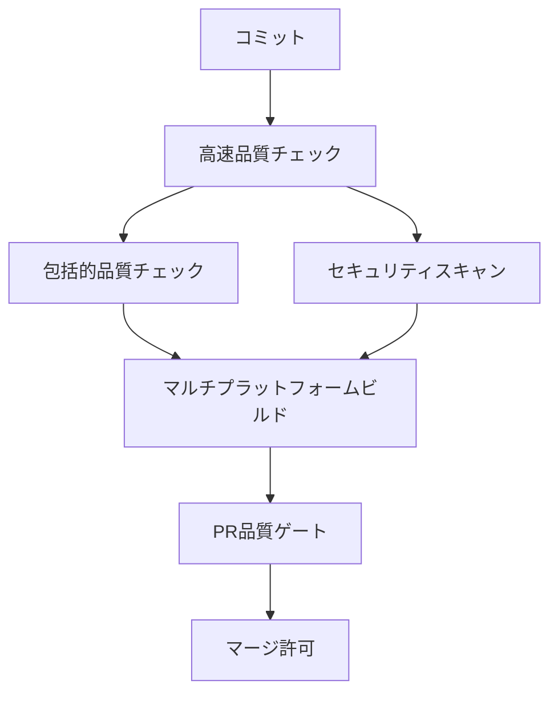

# 🎙️ Murmur

**音声でライフログを記録するElectronアプリ**

Murmurは、音声入力を通じて日常のアイデアやメモを簡単にキャプチャし、OpenAI APIを使って自動的にテキスト化・整形してObsidian Vaultに保存するデスクトップアプリケーションです。

[](https://opensource.org/licenses/MIT)
[](https://www.typescriptlang.org/)
[](https://electronjs.org/)
[](https://openai.com/)
[](https://github.com/nyasuto/murmur/actions)

## ✨ 主な機能

### 🎤 音声録音とテキスト化

- **高品質な音声録音**: MediaRecorder APIを使用した音声キャプチャ
- **リアルタイム音量表示**: 録音中の音声レベルを視覚的に確認
- **音声認識**: OpenAI Whisper APIによる高精度なテキスト変換

### 📝 自動テキスト整形

- **AI整形**: OpenAI GPT APIによる読みやすい形式への自動変換
- **文章構造化**: 要約、見出し、箇条書きなどの適切な構造化
- **即座のプレビュー**: 整形結果をすぐに確認・編集可能

### 📚 Obsidian連携

- **シームレス保存**: 整形したテキストを自動的にObsidian Vaultに保存
- **YAML Front Matter**: メタデータ付きでファイルを整理
- **カスタマイズ可能**: 保存場所や命名規則をカスタマイズ

### ⚙️ ユーザーフレンドリーな設定

- **初回セットアップウィザード**: 起動時に必要な設定を案内
- **設定検証**: API接続やVaultパスの自動検証
- **環境変数管理**: `.env`ファイルの自動生成オプション

## 📋 必要条件

- **Node.js** v20 以上 (推奨: v22 または v24)
- **TypeScript** v5.8+ (開発時)
- **OpenAI APIキー** ([取得方法](#openai-apiキーの取得))
- **Obsidian** ([ダウンロード](https://obsidian.md/))

## 🚀 クイックスタート

### 1. リポジトリのクローンとインストール

```bash
git clone https://github.com/nyasuto/murmur.git
cd murmur
npm install
```

### 2. アプリの起動

```bash
npm run dev
```

初回起動時に**設定ウィザード**が表示されます。画面の指示に従って設定を完了してください。

### 3. 基本的な使い方

1. **🎙️ 録音開始**: 「録音開始」ボタンをクリック（またはスペースキー）
2. **🛑 録音停止**: 再度ボタンをクリックして録音を停止
3. **⏳ 自動処理**: 音声がテキストに変換され、AIが整形
4. **💾 保存**: 「Obsidianに保存」ボタンで保存完了

### 4. ショートカットキー

- **スペースキー**: 録音の開始/停止
- **Escキー**: 内容をクリア / 設定を閉じる

## ⚙️ 詳細設定

### OpenAI APIキーの取得

1. [OpenAI Platform](https://platform.openai.com/api-keys)にアクセス
2. アカウントにログインまたは新規登録
3. 「Create new secret key」をクリック
4. 生成されたAPIキーをコピー（⚠️ 一度しか表示されません）

### Obsidian Vaultの準備

1. [Obsidian](https://obsidian.md/)をダウンロード・インストール
2. 新しいVaultを作成、または既存のVaultを選択
3. Vaultのフォルダパスをメモしておく

### 環境変数設定（オプション）

手動で`.env`ファイルを作成する場合：

```bash
cp .env.example .env
```

`.env`ファイルを編集：

```env
# OpenAI API設定
OPENAI_API_KEY=your_openai_api_key_here

# Obsidian設定
OBSIDIAN_VAULT_PATH=/path/to/your/obsidian/vault

# アプリ設定
NODE_ENV=development
```

## 🛠️ 開発者向け

### 利用可能なコマンド

```bash
# 開発モードで起動
npm run dev

# TypeScriptコンパイル
npm run build:ts

# 本番用アプリをビルド
npm run build

# 配布用パッケージを作成
npm run dist

# TypeScript型チェック
npm run type-check

# コード品質チェック (TypeScript + ESLint + テスト)
make quality

# コードを自動修正してから品質チェック
make quality-fix

# PR準備チェック (品質チェック + 自動修正)
make pr-ready

# Git pre-commitフックを設定
make git-hooks

# すべてのコマンドを表示
make help
```

### プロジェクト構造

```
murmur/
├── main.ts                    # Electronメインプロセス (TypeScript)
├── preload.ts                 # プリロードスクリプト (TypeScript)
├── dist/                      # TypeScriptコンパイル出力
│   ├── main.js               # コンパイル済みメインプロセス
│   ├── preload.js            # コンパイル済みプリロード
│   └── src/                  # コンパイル済みコアモジュール
├── renderer/                  # レンダラープロセス
│   ├── index.html            # メインUI
│   ├── styles.css            # スタイルシート
│   └── renderer.ts           # フロントエンドロジック (TypeScript)
├── src/                       # コアモジュール (TypeScript)
│   ├── types/                # TypeScript型定義
│   ├── openai-client.ts      # OpenAI API通信
│   ├── settings-manager.ts   # 設定管理
│   ├── obsidian-saver.ts     # Obsidian連携
│   └── logger.ts             # ログシステム
├── .github/workflows/         # CI/CD設定 (厳格な品質ゲート)
├── tsconfig.json             # TypeScript設定
├── Makefile                  # 開発ツール
└── README.md                 # このファイル
```

### アーキテクチャ

```
┌─────────────────────────────────────┐
│           Electron App              │
├─────────────────────────────────────┤
│  Renderer Process (Frontend)       │
│  ├─ 音声録音UI                      │
│  ├─ 設定ウィザード                   │
│  └─ 結果表示・編集                   │
├─────────────────────────────────────┤
│  Main Process (Backend)            │
│  ├─ OpenAI API通信                 │
│  ├─ ファイルシステム操作              │
│  ├─ 設定管理                        │
│  └─ Obsidian連携                   │
└─────────────────────────────────────┘
```

## 🎯 使用例

### 📝 日常のメモ取り

「今日のミーティングで話し合った新しいプロジェクトのアイデアについて整理したい」
→ 構造化された議事録として自動整形

### 💡 アイデアのキャプチャ

「散歩中に思いついたアプリの機能について」
→ 分かりやすくカテゴリ分けされたアイデアメモ

### 📖 学習ログ

「今日読んだ本の要点と感想」
→ 読書記録として適切にフォーマット

## 🔧 トラブルシューティング

### よくある問題

**❓ 音声が録音されない**

- ブラウザのマイク権限を確認してください
- 他のアプリでマイクが使用されていないか確認してください

**❓ OpenAI APIエラー**

- APIキーが正しく設定されているか確認してください
- OpenAIアカウントに十分なクレジットがあるか確認してください

**❓ Obsidianに保存されない**

- Vaultパスが正しく設定されているか確認してください
- Vaultフォルダへの書き込み権限があるか確認してください

### サポート

問題が解決しない場合は、[Issues](https://github.com/nyasuto/murmur/issues)で報告してください。

## 🎯 技術的ハイライト

### ✅ 完了済み機能

**🔷 TypeScript完全移行 (2024年6月完了)**

- **Phase 1**: インフラ構築 - tsconfig.json、型定義の基盤構築
- **Phase 2**: 型定義体系化 - IPC通信、API応答、設定管理の型安全化
- **Phase 3**: 全ファイルTS化 - JavaScript→TypeScript完全移行
- **Phase 4**: Strict Mode有効化 - 最高レベルの型安全性達成

**🔷 CI/CD Pipeline厳格化**

- `continue-on-error` 完全排除による品質ゲート強化
- TypeScript strict mode + ESLint + セキュリティスキャンの統合
- 多Node.jsバージョン (20.x/22.x/24.x) 対応確認
- Ubuntu + macOS クロスプラットフォーム動作保証

**🔷 包括的ログシステム**

- 構造化ログによる問題追跡とデバッグ性向上
- プロセス横断ログ統合とローテーション機能
- 開発・本番環境でのログレベル自動調整

### 🎯 アーキテクチャの特徴

**型安全性の徹底**

- IPC通信の完全型付け
- API応答の厳密な型検証
- 設定管理での型強制

**品質保証の自動化**

- Git pre-commitフックでの品質強制
- CI/CDでの段階的品質検証
- PR品質レポートによる可視化

**メンテナンス性の向上**

- 一元化されたMakefileベース開発環境
- CLAUDE.mdによる開発ルール標準化
- TypeScript strict modeによるバグ事前防止

## 🗺️ ロードマップ

### 近日実装予定

- [ ] 音声ファイルのインポート機能
- [ ] カスタムプロンプトテンプレート
- [ ] 複数言語対応
- [ ] ダークモード

### 将来的な構想

- [ ] 画像・スクリーンショットのOCR対応
- [ ] 週次・月次レポート自動生成
- [ ] クラウド同期機能
- [ ] モバイルアプリ連携

## 🚀 品質保証とCI/CD

### 厳格な品質ゲート

Murmurは**継続的品質保証**を重視し、以下の厳格なチェックを実装しています：

#### 🔍 自動品質チェック

- **TypeScript Strict Mode**: 完全な型安全性
- **ESLint**: コード品質とスタイル統一
- **依存関係脆弱性スキャン**: セキュリティ脆弱性の自動検出
- **秘密情報スキャン**: API キーやパスワードの誤コミット防止
- **ライセンス準拠性**: オープンソースライセンスの適合性確認

#### 🌐 マルチプラットフォーム検証

- **Ubuntu**: Linux環境での動作確認
- **macOS**: Apple環境での動作確認
- **Node.js多バージョン**: v20.x, v22.x, v24.x での互換性確認

#### ⚡ 高速フィードバック

- **15-30秒**: 基本品質チェック完了
- **早期エラー検出**: 問題を開発初期段階でキャッチ
- **PR品質レポート**: 詳細な品質状況の可視化

### CI/CDパイプライン



**重要**: すべてのチェックが**PASS**しない限り、コードのマージは**不可能**です。

## 🤝 コントリビューション

プルリクエストや機能提案を歓迎します！

### 必須要件

1. **品質基準の遵守**: すべてのCI/CDチェックがPASSすること
2. **TypeScript Strict Mode**: 型エラー0件での実装
3. **日本語でのIssue作成**: プロジェクトルールに従った日本語での報告

### コントリビューション手順

1. このリポジトリをフォーク
2. フィーチャーブランチを作成 (`git checkout -b feat/amazing-feature`)
3. **ローカルで品質チェック**: `make pr-ready`でPR準備完了を確認
4. 変更をコミット (`git commit -m 'feat: Add some amazing feature'`)
5. ブランチにプッシュ (`git push origin feat/amazing-feature`)
6. プルリクエストを作成
7. **CI/CDパスを確認**: すべての自動チェックの完了を待つ

### 開発ガイドライン

- **厳格な品質基準**: `make quality`がエラー0件で通過すること
- **Conventional Commits**: 統一されたコミットメッセージ形式
- **TypeScript優先**: 新機能はすべてTypeScriptで実装
- **セキュリティ重視**: 秘密情報の誤コミット防止を徹底
- **マルチプラットフォーム対応**: Ubuntu + macOS での動作確認

## 📄 ライセンス

このプロジェクトは[MIT License](LICENSE)の下で公開されています。

## 🙏 謝辞

- [OpenAI](https://openai.com/) - Whisper & GPT API
- [Obsidian](https://obsidian.md/) - 素晴らしいノートアプリ
- [Electron](https://electronjs.org/) - クロスプラットフォーム開発フレームワーク

---

**Made with ❤️ for better life logging**
